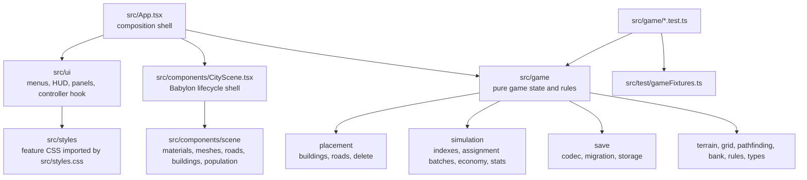

# Simple City Builder

A 3D browser city-builder built with Vite, React, TypeScript, TailwindCSS, Babylon.js, and Vitest.

## Gameplay

- Place houses, workplaces, restaurants, bars, parks, roads, and bridges.
- Drag with the road tool to place straight road lines quickly.
- Connect homes to the regional marker to attract citizens.
- Citizens commute, spend money, visit services, and track happiness and fitness.
- Use the HUD stats and bank panels to inspect revenue, debt, interest, and city wellbeing.
- Saves are stored in browser local storage and migrate from older save versions.

## Controls

- Use the toolbar to choose a build, road, or delete tool.
- Click a tile to place a building, remove an item, or place a single road.
- Click and drag with the road tool to place a longer straight road or bridge line.
- Drag the map to orbit the camera and scroll to zoom.
- Use Save, Load, Bank, Stats, and Menu from the HUD.

## Development

```bash
make up
```

The app runs at [http://localhost:5173/simple_city_builder/](http://localhost:5173/simple_city_builder/).

```bash
make test
make build
make kill
```

## Project Structure



## Architecture

- React owns page flow, HUD composition, selected tool state, and save/load interactions.
- `src/ui/useGameController.ts` coordinates game mutations and delegates ticking/save side effects to `useGameEffects`.
- Babylon.js owns the 3D canvas, camera, terrain meshes, buildings, roads, bridges, population markers, and pointer picking.
- Pure game modules under `src/game` own deterministic terrain, placement rules, pathfinding, save serialization, banking, and simulation.
- The simulation uses derived indexes and cached reachability checks to avoid repeated full scans and repeated pathfinding work.
- Citizen reassignment is bounded per tick; economy and status processing still cover all citizens each tick for stable gameplay.
- Tests are split by behavior area and use shared fixtures from `src/test/gameFixtures.ts`.

## Refactor Conventions

- Target 70-100 lines for meaningful source modules, tests, and CSS feature files.
- Let tiny setup, barrel, and boot files stay below 70 lines when that keeps them honest.
- Split files by responsibility when they grow past 100 lines.
- Keep class names stable during CSS refactors unless the UI behavior changes.
- Keep gameplay constants in `src/game/rules.ts` and type definitions in `src/game/types.ts`.

## Deployment

```bash
make deploy
```

Deployment uses `gh-pages` and publishes the Vite `dist` folder to GitHub Pages with the custom domain `city-builder.thefrenchartist.dev`.
